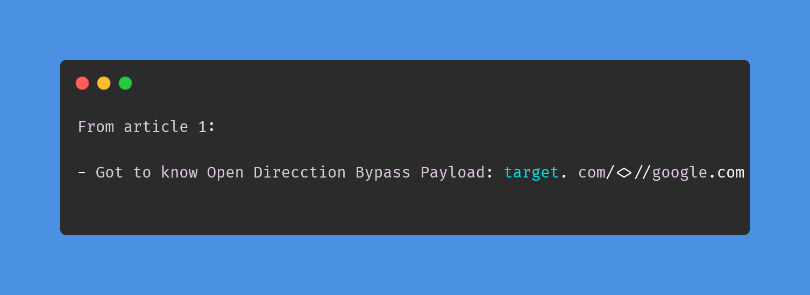
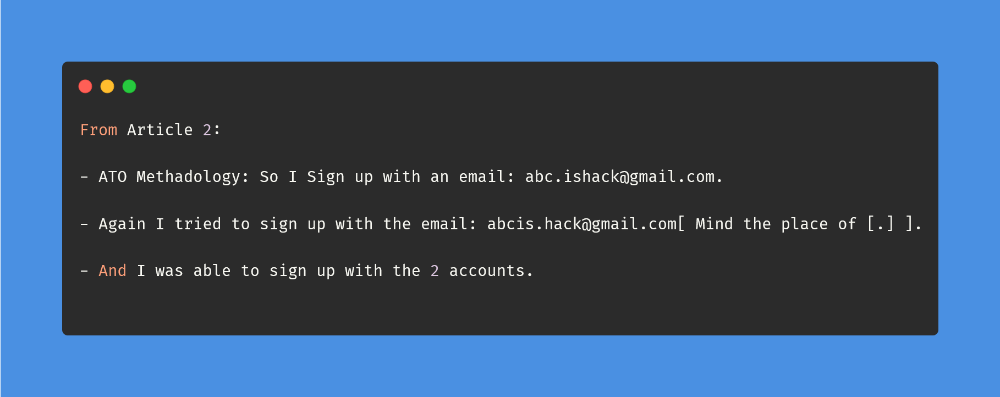
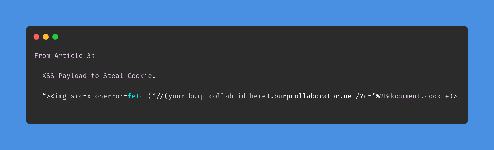

# Day-1 (30-Days-Of-Hacking)

### 1. Read 3 Article: [DONE]

- https://medium.com/@tushar.tilak.sharma/a-tale-of-open-redirection-to-stored-xss-6ad426ae9d43
- https://medium.com/techiepedia/p5-to-p1-intresting-account-takeover-6e59b879494b
- https://medium.com/@tushar.tilak.sharma/how-i-turned-a-self-xss-into-one-click-account-takeover-through-bad-business-logic-ff003c30e96

#### Learned:

### 2. TryHackMe Labs: [DONE]

- [X] Solved Task 1, Task 2, Task 3, Task 4, Task 5 Of **METASPLOIT** : https://tryhackme.com/room/rpmetasploit 
- [X] Solved Task 1, Task 2, Task 4, Task 5, Of : **Dirty Pipe** : https://tryhackme.com/room/dirtypipe  (Unable to get root flag Will try Next day)

### 3. PortSwigger Labs: [DONE]

- [X] **Directory traversal 2/6**
 -  Lab: File path traversal, simple case (https://portswigger.net/web-security/file-path-traversal/lab-simple)
 -  Lab: File path traversal, traversal sequences blocked with absolute path bypass (https://portswigger.net/web-security/file-path-traversal/lab-absolute-path-bypass)

### 4. Youtube Video: {DONE]

- Watched : OrwaGodFather Part 1 Video : https://www.youtube.com/watch?v=06JYV06y-hU
