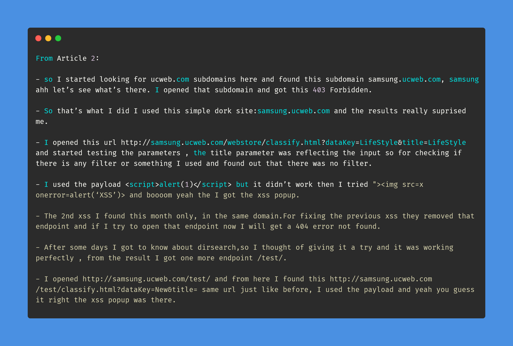
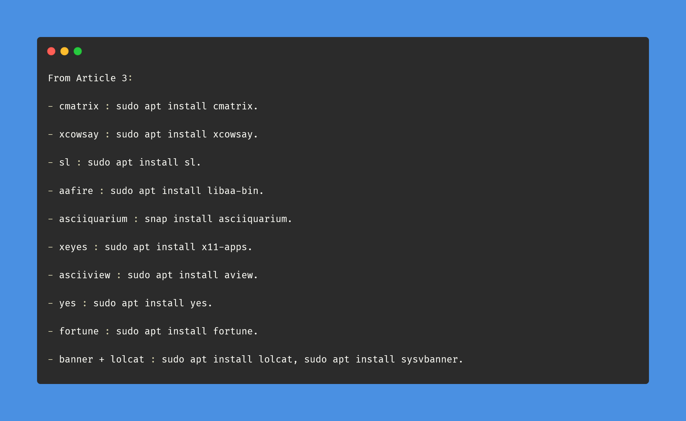

# Day-14 (30-Days-Of-Hacking)

### 1. Read 3 Article: [DONE]

- https://vamshi-vemula.medium.com/how-i-got-my-first-bounty-open-redirect-80832e5bf4e6
- https://medium.com/@sudhanshur705/story-about-my-first-bug-bounty-9fe710be8241
- https://shambhavishandilya.medium.com/linux-commands-to-have-fun-on-terminal-2df8da483d59

#### Learned:

    

### 2. TryHackMe Labs: [HALF DONE]

 - [X] Solved Half Room On **Brute It** : (https://tryhackme.com/room/bruteit)

### 3. PortSwigger Labs: [DONE]

 - [X] **Information disclosure (5/5)**
 -  Lab: Information disclosure in version control history  (https://portswigger.net/web-security/information-disclosure/exploiting/lab-infoleak-in-version-control-history)

### 4. Youtube Video: [TODAY TIRED AF HAVEN'T WATCHED ANYTHING]
