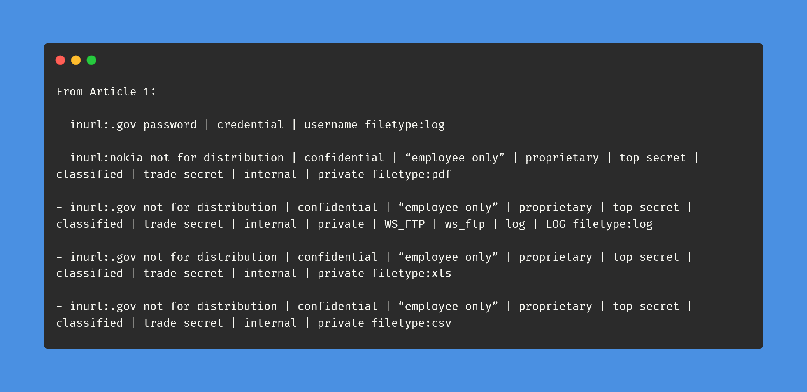

# Day-15 (30-Days-Of-Hacking)

### 1. Read 3 Article: [DONE]

- https://debprasadbanerjee502.medium.com/google-dork-for-instant-bounties-a332764fc3e2
- https://medium.com/@dnyanesh766/use-of-default-credentials-to-unauthorised-remote-access-of-internal-panel-of-network-video-5490d107fa0
- https://thenurhabib.medium.com/one-liner-bug-bounty-tips-fa386b756e16

#### Learned:

    

### 2. TryHackMe Labs: [DONE]

 - [X] Solved Complete Room On **Brute It** : (https://tryhackme.com/room/bruteit)

### 3. PortSwigger Labs: [DONE]

 - [X] **Authentication (1/14)**
 -  Lab: Username enumeration via different responses  (https://portswigger.net/web-security/authentication/password-based/lab-username-enumeration-via-different-responses)

### 4. Youtube Video: [TODAY TIRED AF HAVEN'T WATCHED ANYTHING]
