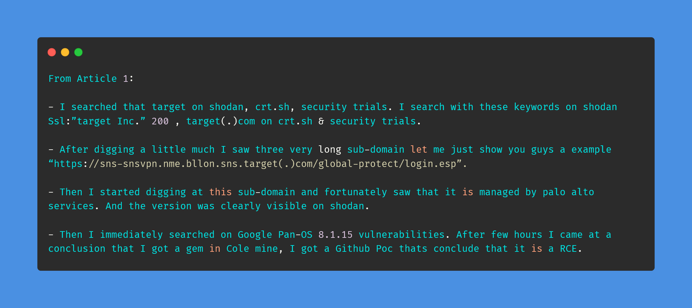
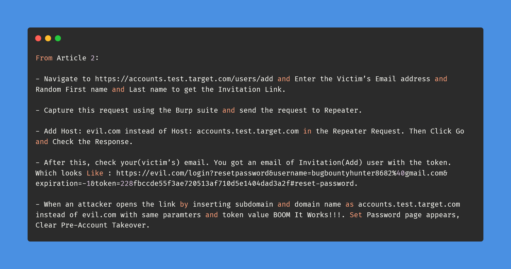
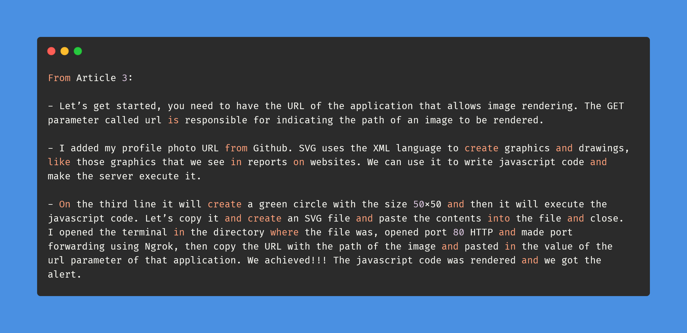

# Day-17 (30-Days-Of-Hacking)

### 1. Read 3 Article: [DONE]

- https://medium.com/@vivekkashyap0707/my-first-rce-from-n-a-to-triaged-cve-2021-3064-acdd0541c664
- https://medium.com/@rupachandransangothi22/host-header-injection-leads-to-pre-account-takeover-worth-100-1bd8f2d51876
- https://medium.com/@mrempy/cross-site-scripting-xss-via-image-rendering-application-f8427afe746d

#### Learned:

### 2. TryHackMe Labs: [HALF DONE]

 - [X] Solved Task:1,2,3,4,5,7 Of **Crack The Hash Level 2** : (https://tryhackme.com/room/crackthehashlevel2)

### 3. PortSwigger Labs: [DONE]

 - [X] **Authentication (3/14)**
 -  Lab: Password reset broken logic   (https://portswigger.net/web-security/authentication/other-mechanisms/lab-password-reset-broken-logic)

### 4. Youtube Video: [DONE]

- Watched Confidential Document (Sensitive Data Exposure) [OWASP JUICE SHOP] (https://www.youtube.com/watch?v=Yi7OiMtzGXc)
