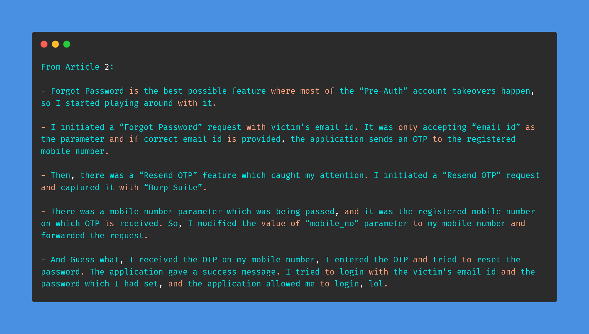
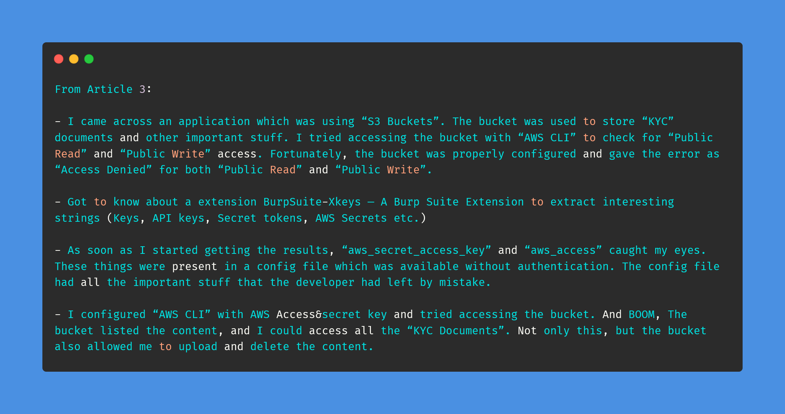

# Day-18 (30-Days-Of-Hacking)

### 1. Read 3 Article: [DONE]

- https://pawanchhabria.medium.com/how-i-accessed-the-sensitive-document-which-i-had-already-deleted-adbc1e6fbb25
- https://pawanchhabria.medium.com/my-first-pre-auth-account-takeover-in-20-secs-7c90fd273ffa
- https://pawanchhabria.medium.com/how-i-was-able-to-access-a-properly-configured-s3-bucket-a0e949446341

#### Learned:

### 2. TryHackMe Labs: [HALF DONE]

 - [X] Solved 2 More hashes Of **Crack The Hash Level 2** : (https://tryhackme.com/room/crackthehashlevel2)

### 3. PortSwigger Labs: [DONE]

 - [X] **Authentication (4/14)**
 -  Lab: Username enumeration via subtly different responses   (https://portswigger.net/web-security/authentication/password-based/lab-username-enumeration-via-subtly-different-responses)

### 4. Youtube Video: [DONE]

- Watched FIND HIDDEN PARAMETERS WITH PARAMINER (https://www.youtube.com/watch?v=oUuz242c92M)
