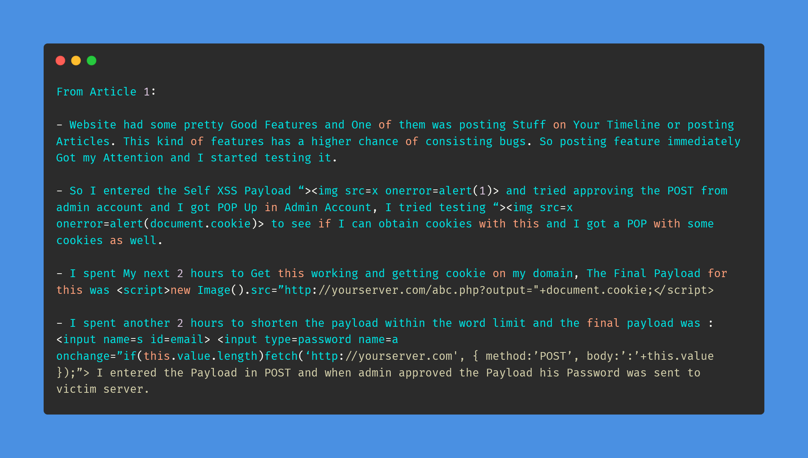
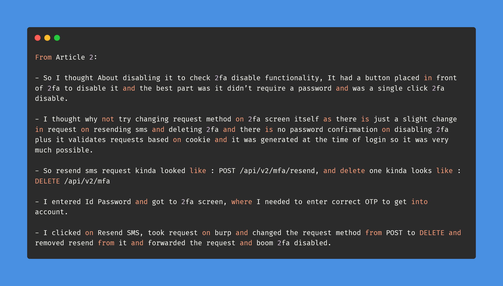

# Day-19 (30-Days-Of-Hacking)

### 1. Read 3 Article: [DONE]

- https://medium.com/@arthbajpai277/stored-xss-to-stealing-admin-credentials-to-your-domain-2ec10cb68bed
- https://medium.com/@arthbajpai277/2fa-bypass-by-changing-request-method-to-delete-500fd0ed12b8
- https://medium.com/@arthbajpai277/idor-leads-to-2fa-bypass-3331cec2db64

#### Learned:

### 2. TryHackMe Labs: [HALF DONE, THIS ROOM IS HARDDDDDDDDDDDD]

 - [X] Solved 2 More hashes Of **Crack The Hash Level 2** : (https://tryhackme.com/room/crackthehashlevel2)

### 3. PortSwigger Labs: [DONE]

 - [X] **Authentication (5/14)**
 -  Lab: Username enumeration via response timing   (https://portswigger.net/web-security/authentication/password-based/lab-username-enumeration-via-response-timing)

### 4. Youtube Video: [DONE]

- Learn with Remonsec: How to approach sensitive information disclosure. (https://www.youtube.com/watch?v=0EyVb0x-oJU)
