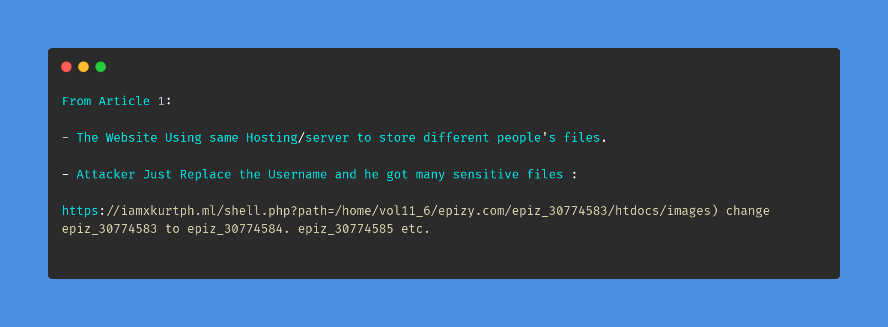
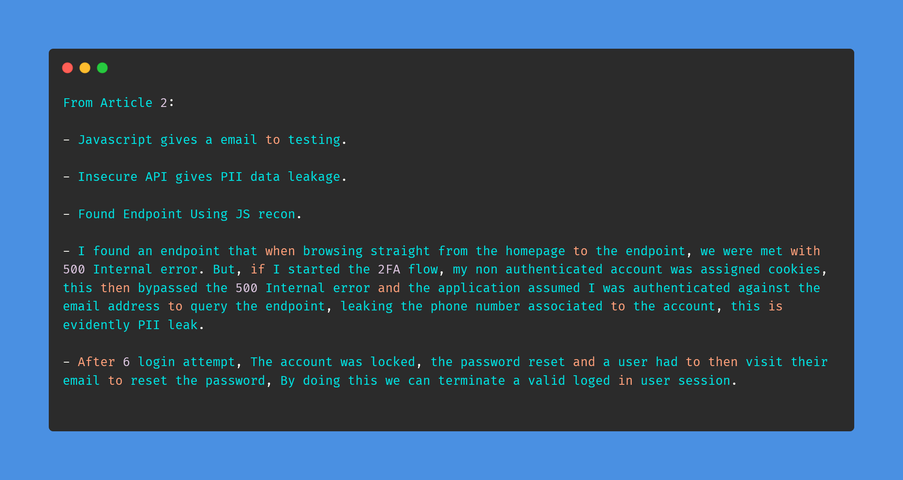
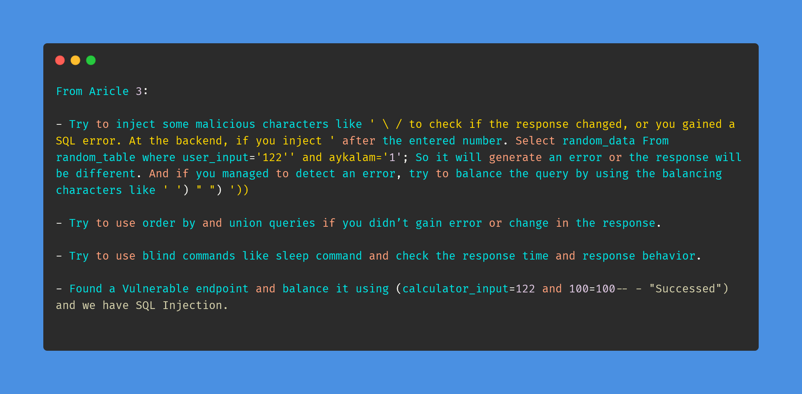

# Day-2 (30-Days-Of-Hacking)

### 1. Read 3 Article: [DONE]

- https://xkurtph.medium.com/how-i-access-other-domains-in-infinityfree-net-using-directory-traversal-4625692d6a2d
- https://medium.com/@tobydavenn/how-i-made-the-bbc-hall-of-fame-3-times-2c816fa515d7
- https://infosecwriteups.com/sql-injection-at-spotify-d19e0861ddf0

#### Learned:

  
### 2. TryHackMe Labs: [DONE]

- [X] Solved Task 6, Task 7 And Completed The Room Of **METASPLOIT** : https://tryhackme.com/room/rpmetasploit 
- [X] Solved Task 3 And Completed The Room Of : **Dirty Pipe** : https://tryhackme.com/room/dirtypipe  (This Time Got the ROOT Flag)

### 3. PortSwigger Labs: [DONE]

- [X] **Directory traversal (4/6)**
 -  Lab: File path traversal, traversal sequences stripped non-recursively (https://portswigger.net/web-security/file-path-traversal/lab-sequences-stripped-non-recursively)
 -  Lab: File path traversal, traversal sequences stripped with superfluous URL-decode (https://portswigger.net/web-security/file-path-traversal/lab-superfluous-url-decode)
 
 ### 4. Youtube Video: [DONE]

- Watched : OrwaGodFather Part 2 Video : https://www.youtube.com/watch?v=YoXM4m1VEM0&t=1s
