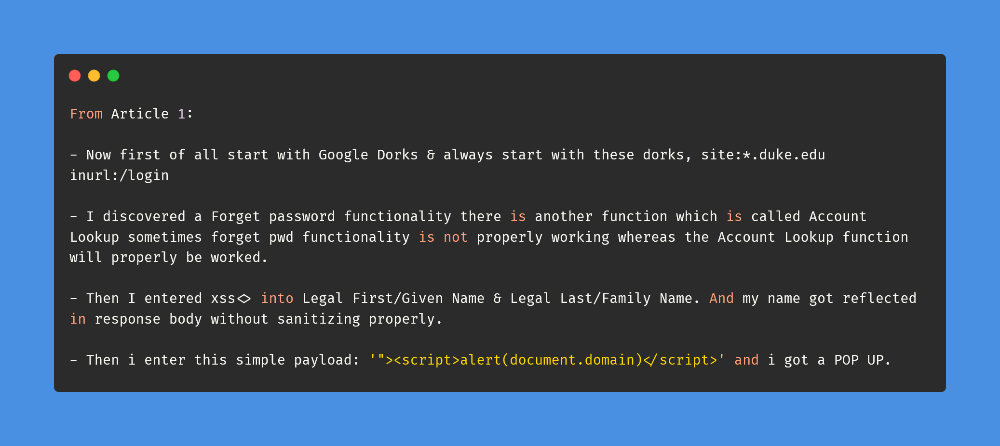
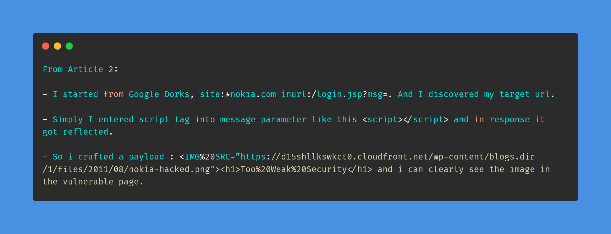
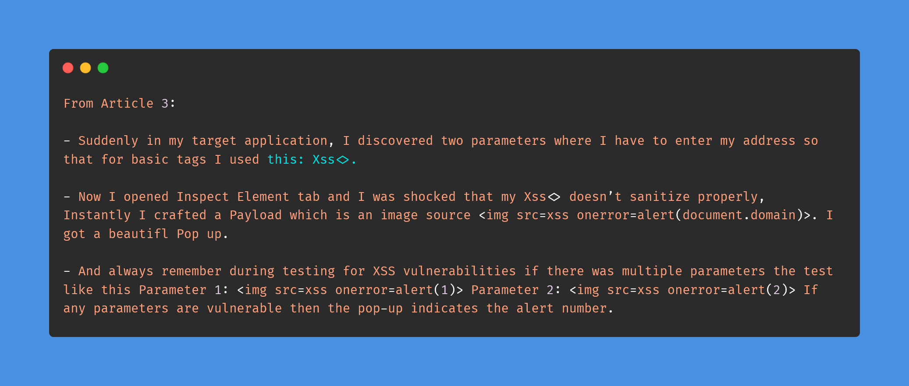

# Day-20 (30-Days-Of-Hacking)

### 1. Read 3 Article: [DONE]

- https://amit-lt.medium.com/multiple-times-i-hacked-duke-university-with-rxss-vulnerability-7e291aad043a
- https://amit-lt.medium.com/hacked-nokia-with-reflected-cross-site-scripting-vulnerability-327daa8e62fb
- https://amit-lt.medium.com/scenario-of-reflected-cross-site-scripting-vulnerability-a3ee189dd822

#### Learned:

### 2. TryHackMe Labs: [DONE]

 - [X] Solved Complete Room On **Crack The Hash Level 2** : (https://tryhackme.com/room/crackthehashlevel2)

### 3. PortSwigger Labs: [DONE]

 - [X] **Authentication (6/14)**
 -  Lab: Broken brute-force protection, IP block   (https://portswigger.net/web-security/authentication/password-based/lab-broken-bruteforce-protection-ip-block)

### 4. Youtube Video: [DONE]

- 2FA bypasses: Logical Thinking for contexts By Aditya Shinde On Securzy (WAS A ZOOM MEETING)
