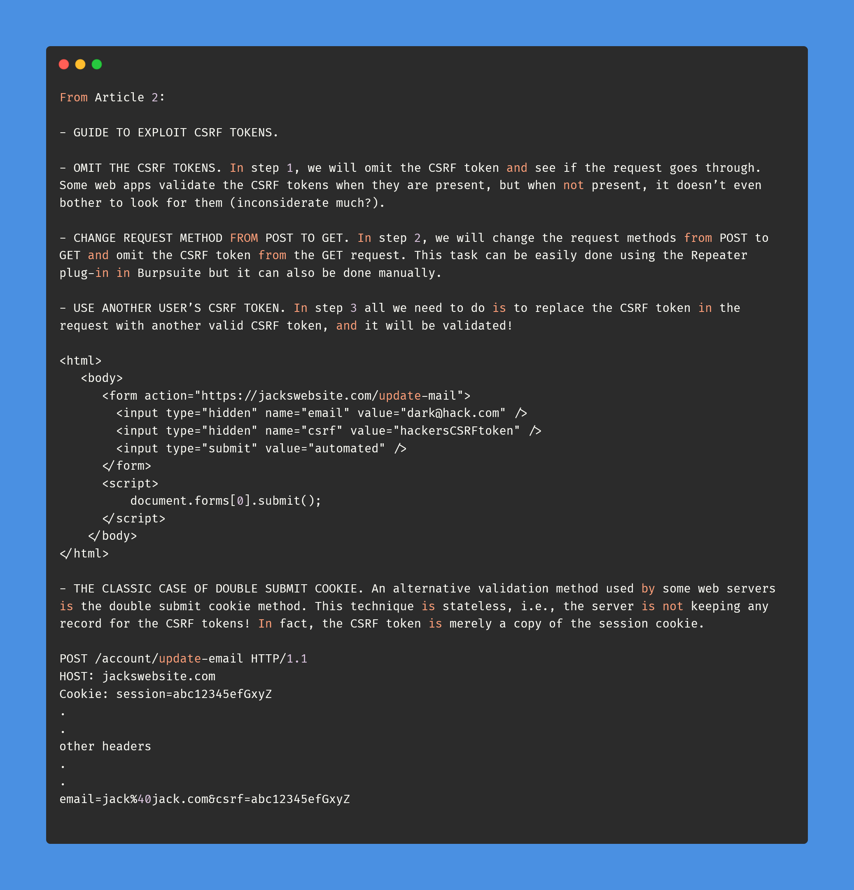
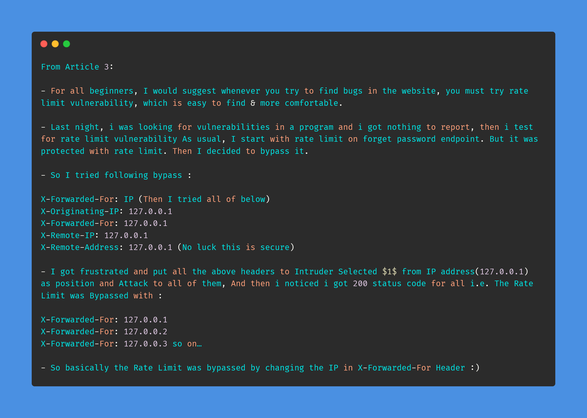

# Day-21 (30-Days-Of-Hacking)

### 1. Read 3 Article: [DONE]

- https://systemweakness.com/introduction-to-csrf-how-can-a-cookie-get-you-hacked-1-2-d34e0a0e6319
- https://shubhangivashist.medium.com/introduction-to-csrf-stepwise-guide-to-bypass-csrf-tokens-2-2-1375b30d479e
- https://medium.com/@cyberxprite/an-interesting-rate-limit-bypass-2d4728699f71

#### Learned:

### 2. TryHackMe Labs: [DONE]

 - [X] Solved Complete Room On **Spring4Shell** : (https://tryhackme.com/room/spring4shell)

### 3. PortSwigger Labs: [DONE]

 - [X] **Authentication (7/14)**
 -  Lab: Lab: Username enumeration via account lock   (https://portswigger.net/web-security/authentication/password-based/lab-username-enumeration-via-account-lock)

### 4. Youtube Video: [DONE]

- How To Hunt: Cross-Site Request Forgery (CSRF) - Kathan Patel (https://www.youtube.com/watch?v=9eIUfCXyRgE)
