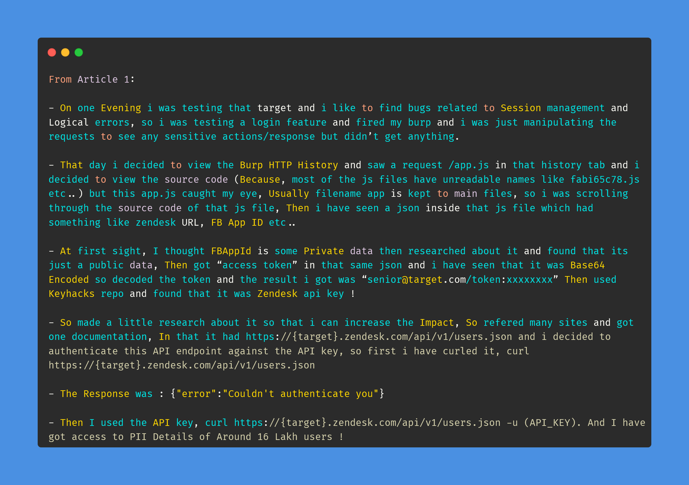

# Day-23 (30-Days-Of-Hacking)

### 1. Read 3 Article: [DONE]

- https://gokulap.medium.com/how-i-got-access-to-1600k-users-pii-data-64a27a540963
- https://medium.com/hackenproof/catching-a-bug-in-under-12-minutes-2bbc2b66fb77
- https://medium.com/@spanikan/open-redirect-everywhere-c3575ad41f69

#### Learned:

### 2. TryHackMe Labs: [DONE]

 - [X] Solved Complete Room On **Web Scanning** : (https://tryhackme.com/room/rpwebscanning)

### 3. PortSwigger Labs: [DONE]

 - [X] **Authentication (9/14)**
 -  Lab: Brute-forcing a stay-logged-in cookie   (https://portswigger.net/web-security/authentication/other-mechanisms/lab-brute-forcing-a-stay-logged-in-cookie)

### 4. Youtube Video: [DONE]

- IDOR vulnerability (https://www.youtube.com/watch?v=zVHA8Gg-IlY&t=568s)
