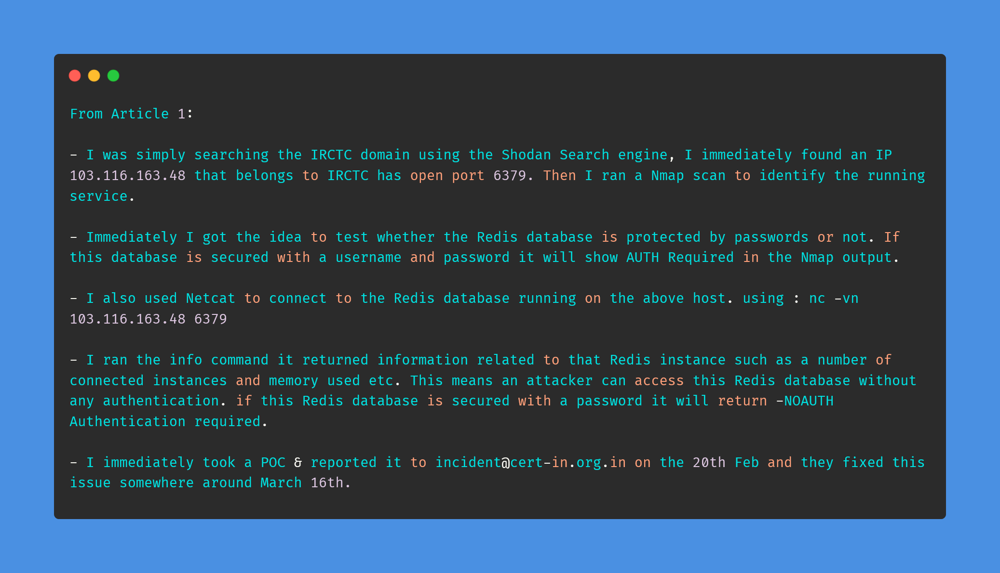
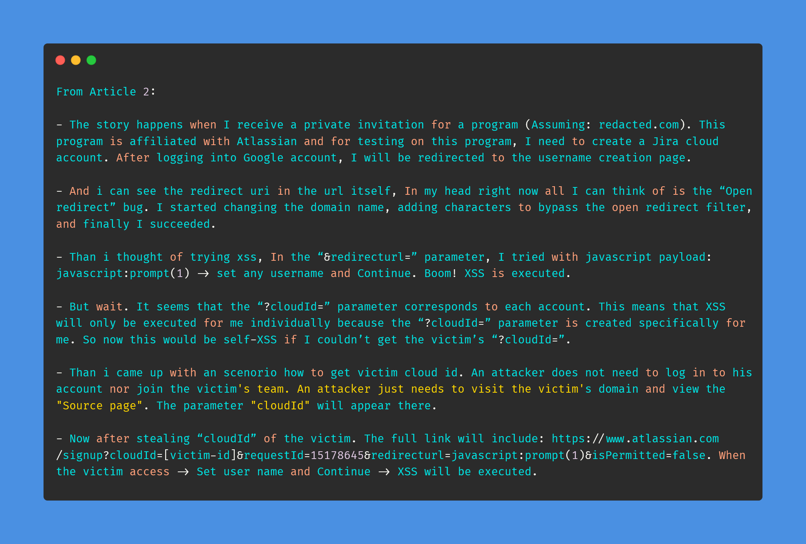
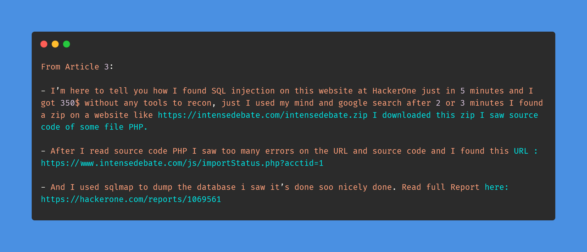

# Day-24 (30-Days-Of-Hacking)

### 1. Read 3 Article: [DONE]

- https://medium.com/@harishhacker3010/how-i-hacked-the-irctc-database-in-5-mins-86954f2261db
- https://infosecwriteups.com/how-i-found-my-first-xss-bug-96fb8e85a24c
- https://ahmadaabdulla.medium.com/how-i-found-sql-injection-on-intensedebate-com-h1-in-5-minute-350-a36c2890882d

#### Learned:

### 2. TryHackMe Labs: [DONE]

 - [X] Solved Complete Room On **Inclusion** : (https://tryhackme.com/room/inclusion)

### 3. PortSwigger Labs: [DONE]

 - [X] **Authentication (9/14)**
 -  Lab: Offline password cracking   (https://portswigger.net/web-security/authentication/other-mechanisms/lab-offline-password-cracking)

### 4. Youtube Video: [DONE]

- Bypassing a WAF by Finding the Origin IP (https://www.youtube.com/watch?v=jfjzYpgte-A)