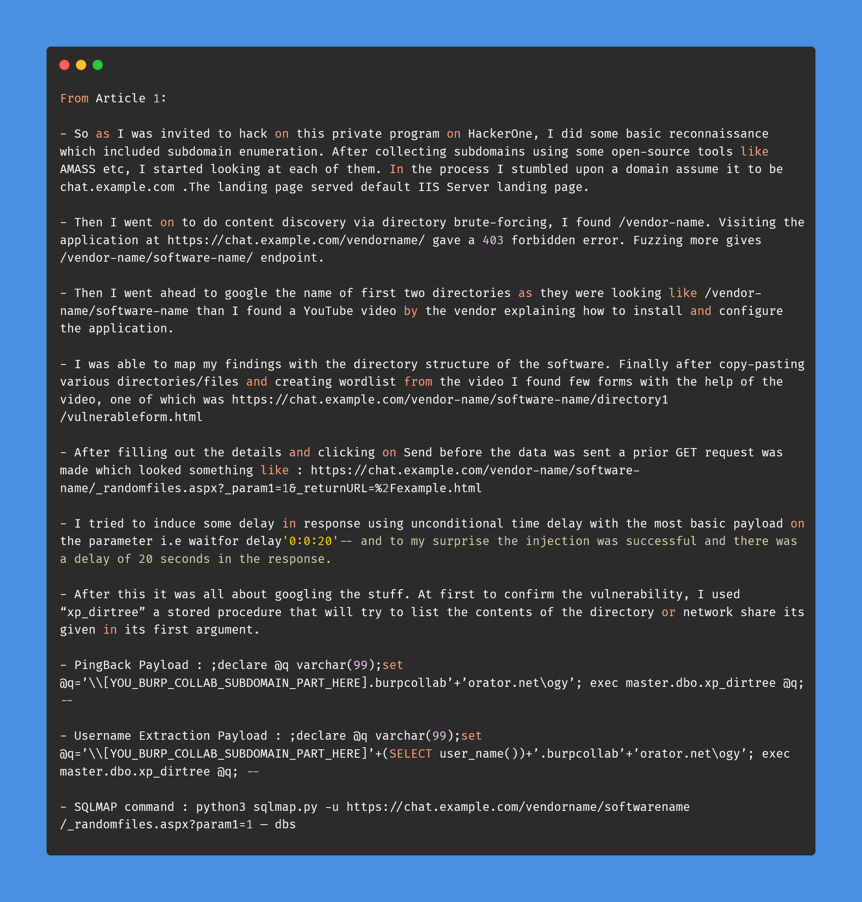
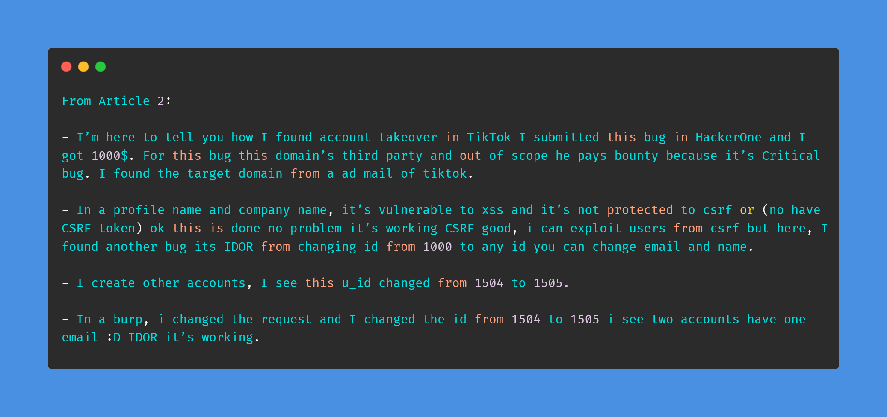
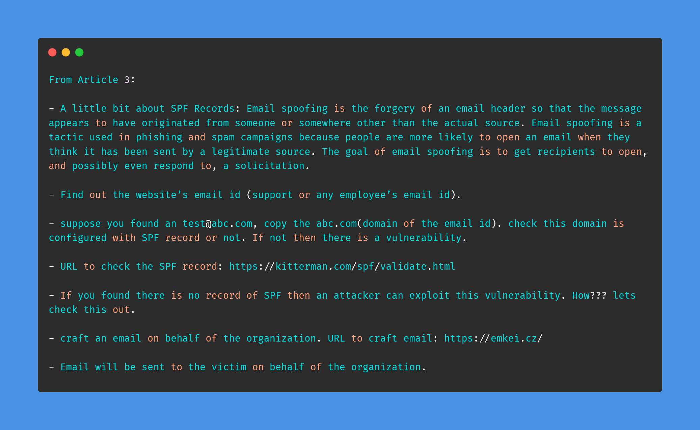

# Day-25 (30-Days-Of-Hacking)

### 1. Read 3 Article: [DONE]

- https://medium.com/@k4k4r07/how-a-youtube-video-lead-to-pwning-a-web-application-via-sql-injection-worth-4324-bounty-285f0a9b9f6c
- https://ahmadaabdulla.medium.com/vulnerabilitymultiple-vulnerability-leading-to-account-takeover-in-tiktok-smb-subdomain-c99e4a50b377
- https://medium.com/@awezkagdi.ak/no-valid-spf-records-an-attacker-can-send-an-email-on-behalf-of-the-organization-or-ceo-89b2ff7f7afb

#### Learned:

### 2. TryHackMe Labs: [DONE]

 - [X] Solved Complete Room On **LFI_BASICS** : (https://tryhackme.com/room/lfibasics)

### 3. PortSwigger Labs: [DONE]

 - [X] **Authentication (10/14)**
 -  Lab: Password reset poisoning via middleware   (https://portswigger.net/web-security/authentication/other-mechanisms/lab-password-reset-poisoning-via-middleware)

### 4. Youtube Video: [DONE]

- Bruteforce Attacks and Bypassing Rate Limits with Fireprox (https://www.youtube.com/watch?v=it_V3ig1_4o)