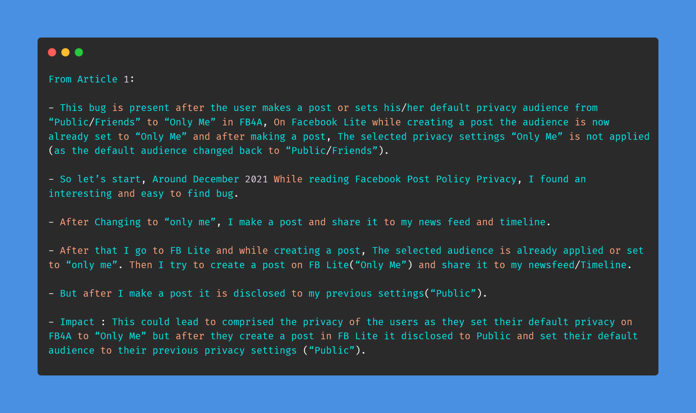
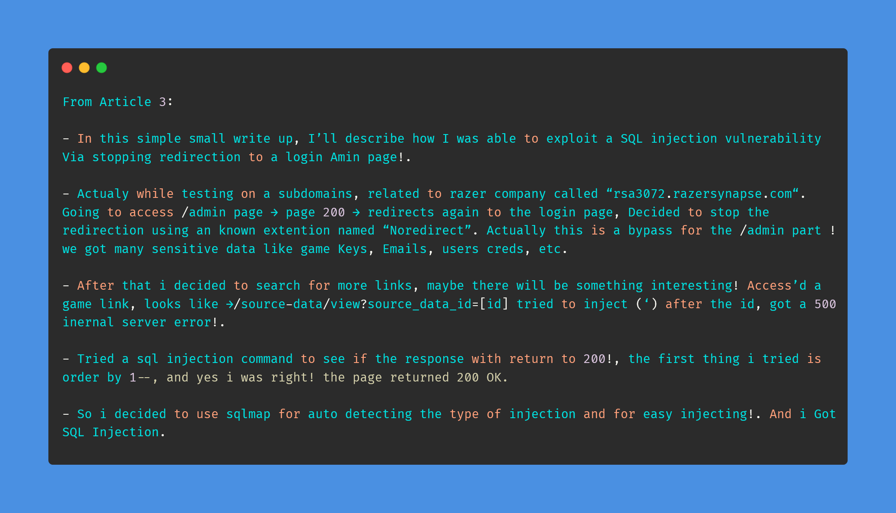

# Day-27 (30-Days-Of-Hacking)

### 1. Read 3 Article: [DONE]

- https://medium.com/@RheyJuls/privacy-disclosure-on-facebook-lite-after-creating-a-post-b12a1cad8d8a
- https://medium.com/@colinwinhall/stripe-checkout-misconfiguration-leads-to-an-unlimited-trial-period-b47ba481a249
- https://medium.com/@St00rm/sql-injection-via-stopping-the-redirection-to-a-login-page-52b0792d5592

#### Learned:

        

### 2. TryHackMe Labs: [DONE]

 - [X] Solved Complete Room On **Vulnversity** : (https://tryhackme.com/room/vulnversity)

### 3. PortSwigger Labs: [DONE]

 - [X] **Authentication (13/14)**
 -  Lab: Broken brute-force protection, multiple credentials per request   (https://portswigger.net/web-security/authentication/password-based/lab-broken-brute-force-protection-multiple-credentials-per-request)

### 4. Youtube Video: [DONE]

- Browser in the Browser Attack || Advaced (P)hishing technique (https://www.youtube.com/watch?v=5TbKD6R8Ha0)