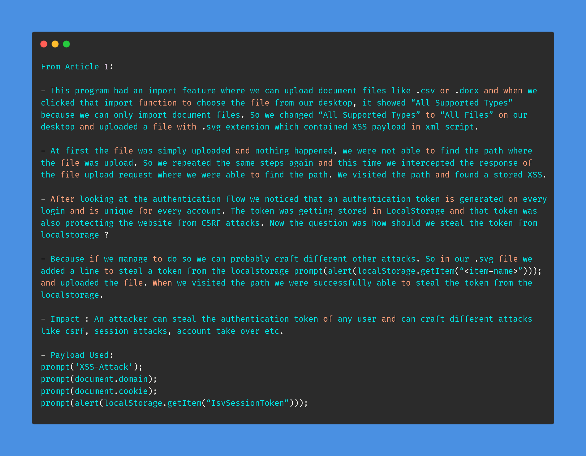
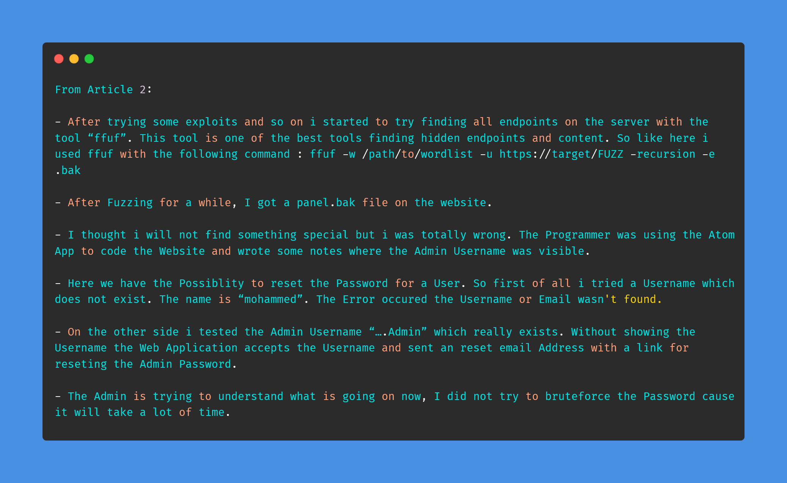
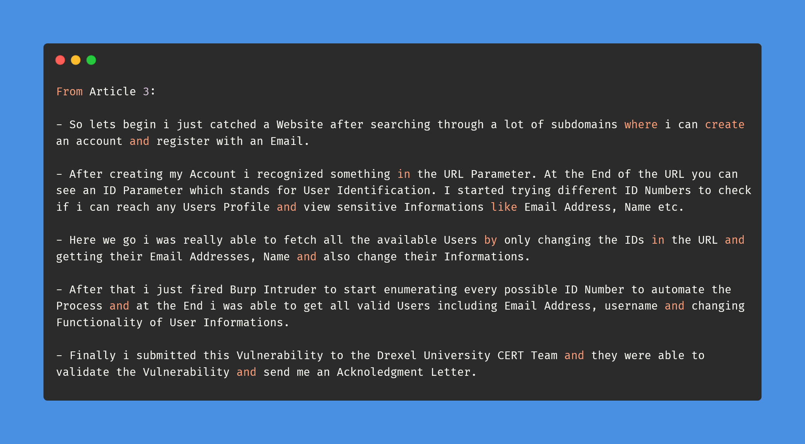

# Day-28 (30-Days-Of-Hacking)

### 1. Read 3 Article: [DONE]

- https://shahjerry33.medium.com/xss-the-localstorage-robbery-d5fbf353c6b0
- https://medium.com/@Bishoo97x/admin-username-disclosure-9c03dd30e8dd
- https://medium.com/@Bishoo97x/idor-insecure-direct-object-reference-leads-to-listing-all-valid-users-and-edit-their-profiles-2d7bcba78890

#### Learned:

        

### 2. TryHackMe Labs: [DONE]

 - [X] Solved Complete Room On **SSTI And Juicy Details** : (https://tryhackme.com/room/learnssti, https://tryhackme.com/room/juicydetails)

### 3. PortSwigger Labs: [DONE]

 - [X] **OS Command Injection (3/5)**
 -  Lab: OS command injection, simple case   (https://portswigger.net/web-security/os-command-injection/lab-simple)
 -  Lab: Blind OS command injection with time delays  (https://portswigger.net/web-security/os-command-injection/lab-blind-time-delays)
 -  Lab: Blind OS command injection with output redirection  (https://portswigger.net/web-security/os-command-injection/lab-blind-output-redirection)

### 4. Youtube Video: [DONE]

- Server Side Template Injection Explanation & Exploitation (https://www.youtube.com/watch?v=TfgQ8A_bGXM&t=311s)