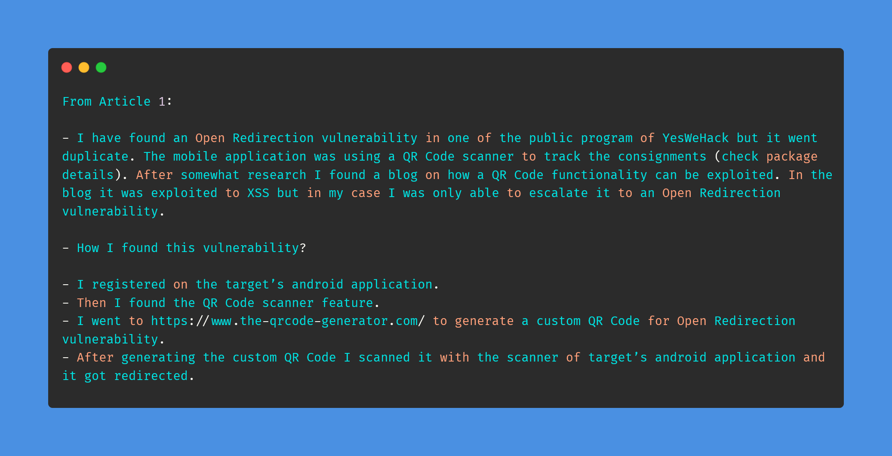

# Day-29 (30-Days-Of-Hacking)

### 1. Read 3 Article: [DONE]

- https://shahjerry33.medium.com/open-redirection-qr-code-magic-18ace1a0170f
- https://shahjerry33.medium.com/business-logic-errors-a-logic-destruction-477c4ebc824b
- https://shahjerry33.medium.com/business-logic-errors-must-vote-68f642b60fb7

#### Learned:

        

### 2. TryHackMe Labs: [HALF DONE]

 - [X] Solved Half Room On **Linux Server Forensics** : (https://tryhackme.com/room/linuxserverforensics)

### 3. PortSwigger Labs: [DONE]

 - [X] **OS Command Injection (4/5)**
 -  Lab: Blind OS command injection with out-of-band interaction   (https://portswigger.net/web-security/os-command-injection/lab-blind-out-of-band)

### 4. Youtube Video: [DONE]

- Bug Bounty Redacted #2: Third Party Subdomain Takeover & Exposed Admin Interfaces (https://www.youtube.com/watch?v=kcSc5jL-FdU)