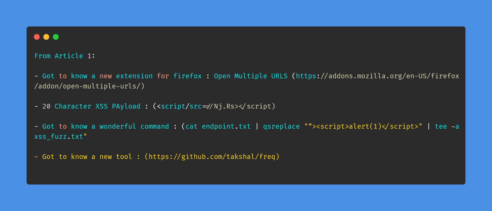
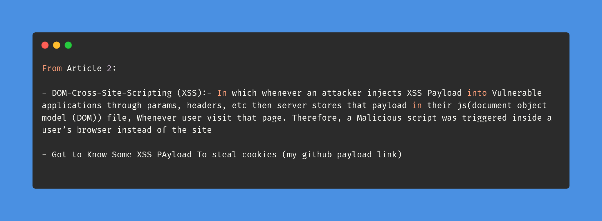
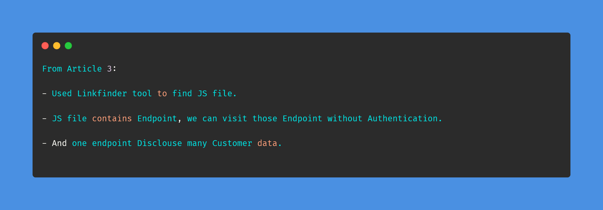

# Day-3 (30-Days-Of-Hacking)

### 1. Read 3 Article: [DONE]

- https://infosecwriteups.com/how-i-was-able-to-find-50-cross-site-scripting-xss-security-vulnerabilities-on-bugcrowd-public-ba33db2b0ab1
- https://as745591.medium.com/albussec-penetration-list-05-cross-site-scripting-xss-part-1-41a0f460a15c
- https://infosecwriteups.com/how-did-i-leak-5-2k-customer-data-from-a-large-company-via-broken-access-control-709eb4027409

#### Learned:

### 2. TryHackMe Labs: [DONE]

- [X] Solved Complete Room Of **TMUX** : https://tryhackme.com/room/rptmux

### 3. PortSwigger Labs: [DONE]

- [X] **Directory traversal Labs (6/6)**
 -  Lab: Lab: File path traversal, validation of start of path (https://portswigger.net/web-security/file-path-traversal/lab-validate-start-of-path)
 -  Lab: Lab: File path traversal, validation of file extension with null byte bypass (https://portswigger.net/web-security/file-path-traversal/lab-validate-file-extension-null-byte-bypass)

### 4. Youtube Video: [DONE]

- Watched : OrwaGodFather Part 3 Video : https://www.youtube.com/watch?v=L0-aa60CZuI&t=140s
