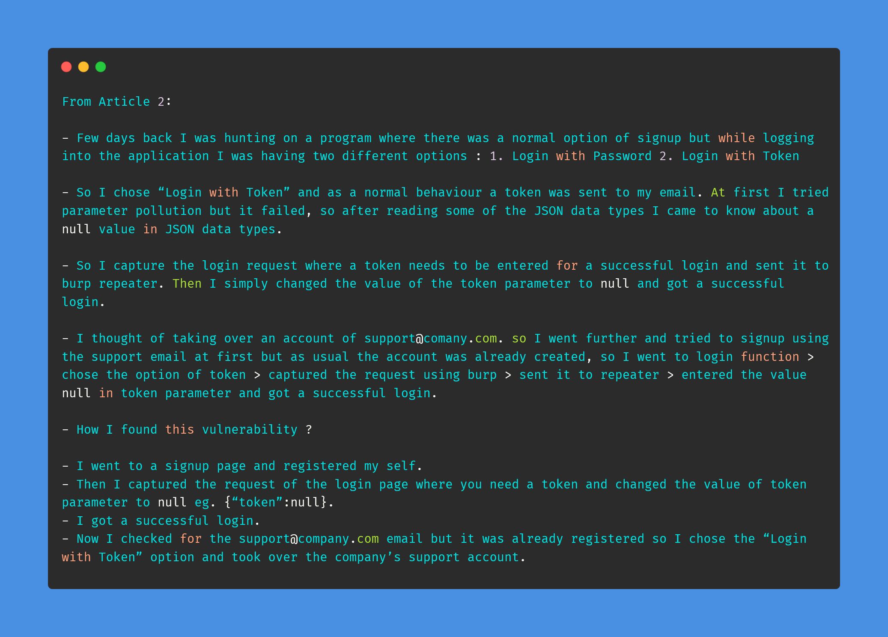
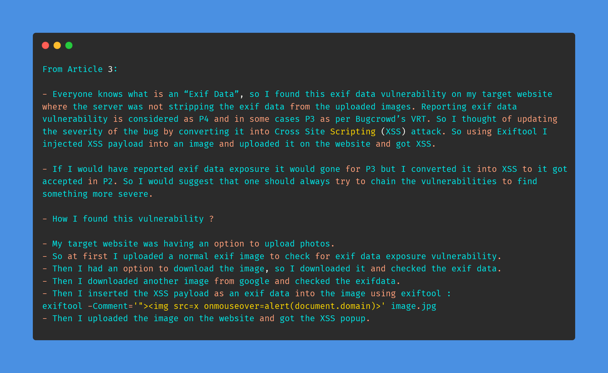

# Day-30 (30-Days-Of-Hacking)

### 1. Read 3 Article: [DONE]

- https://shahjerry33.medium.com/pii-leakage-revealing-secrets-8b617071bd1c
- https://shahjerry33.medium.com/account-takeover-smoking-with-null-e43df2c3bb41
- https://shahjerry33.medium.com/xss-via-exif-data-the-p2-elevator-d09e7b7fe9b9

#### Learned:

        

### 2. TryHackMe Labs: [DONE]

 - [X] Solved Complete Room On **Linux Server Forensics** : (https://tryhackme.com/room/linuxserverforensics)

### 3. PortSwigger Labs: [DONE]

 - [X] **OS Command Injection (5/5)**
 -  Lab: Blind OS command injection with out-of-band data exfiltration   (https://portswigger.net/web-security/os-command-injection/lab-blind-out-of-band-data-exfiltration)

### 4. Youtube Video: [DONE]

- [Hindi] Manual Reconnaissance Methodology for Absolute Beginners | Bug Bounty Tips | R0X4R (https://www.youtube.com/watch?v=gu2rYMLFfvQ)