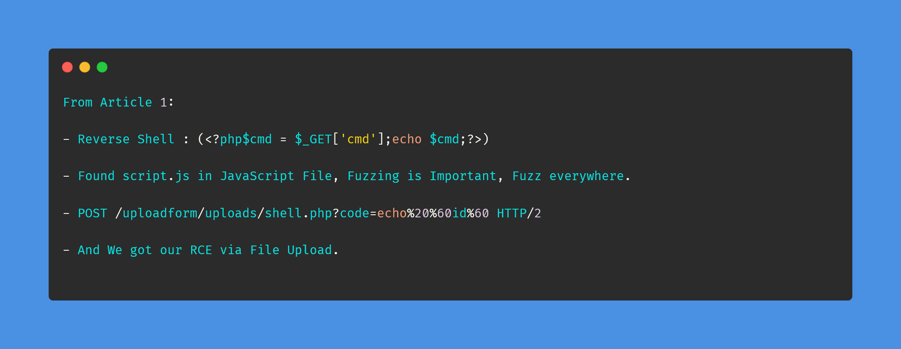
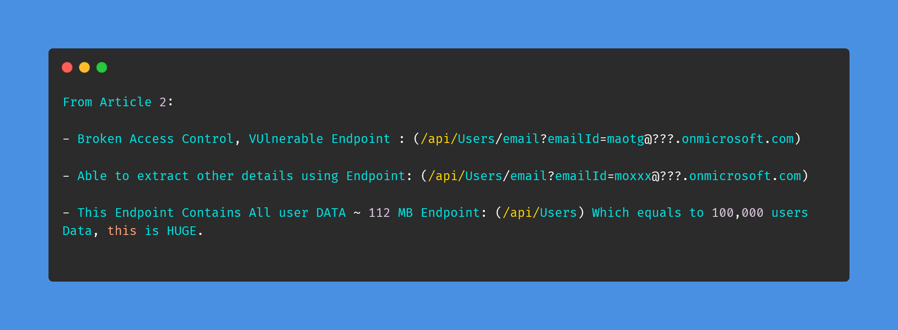
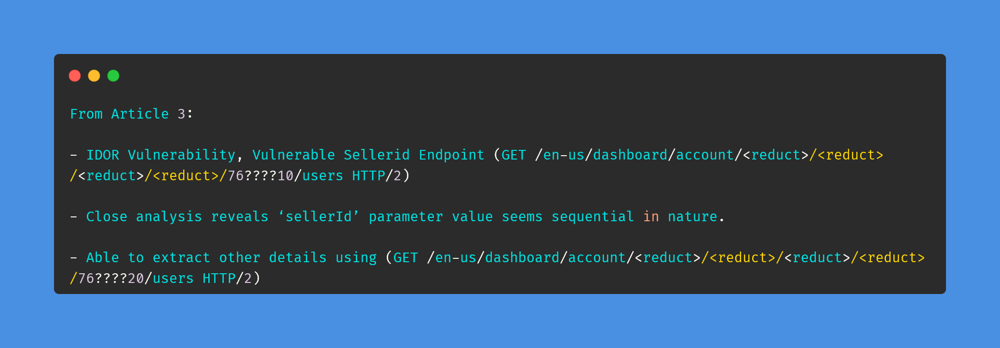

# Day-5 (30-Days-Of-Hacking)

### 1. Read 3 Article: [DONE]

- https://medium.com/@haroonhameed_76621/achieving-remote-code-execution-via-unrestricted-file-upload-6050f360c218
- https://mearegtu.medium.com/broken-access-control-cc6cfd793b15
- https://mearegtu.medium.com/insecure-direct-object-reference-exposes-all-users-of-microsoft-azure-independent-software-vendors-bed3b45e509

#### Learned:

### 2. TryHackMe Labs: [DONE]

 - [X] Solved Complete Room Of **Hydra && Sublist3r** : https://tryhackme.com/room/hydra , https://tryhackme.com/room/rpsublist3r
  
### 3. PortSwigger Labs: [DONE]

 - [X] **Access control vulnerabilities (7/13)**
 -  Lab: User ID controlled by request parameter  (https://portswigger.net/web-security/access-control/lab-user-id-controlled-by-request-parameter)
 -  Lab: User ID controlled by request parameter with data leakage in redirect  (https://portswigger.net/web-security/access-control/lab-user-id-controlled-by-request-parameter-with-data-leakage-in-redirect)
 -  Lab: User ID controlled by request parameter with password disclosure (https://portswigger.net/web-security/access-control/lab-user-id-controlled-by-request-parameter-with-password-disclosure)
 -  Lab: Insecure direct object references (https://portswigger.net/web-security/access-control/lab-insecure-direct-object-references)
  
### 4. Youtube Video: [HALF DONE]

 - Watched : BittenTech HTTP Security Headers | Content Security Policy (CSP) | Strict Transport Security (HSTS) : (https://www.youtube.com/watch?v=8_nfQAdWELU&t=1148s)
