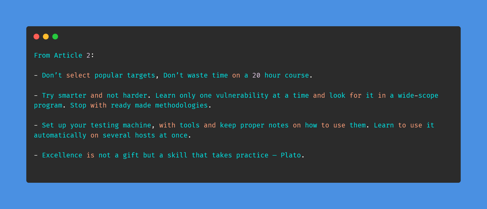
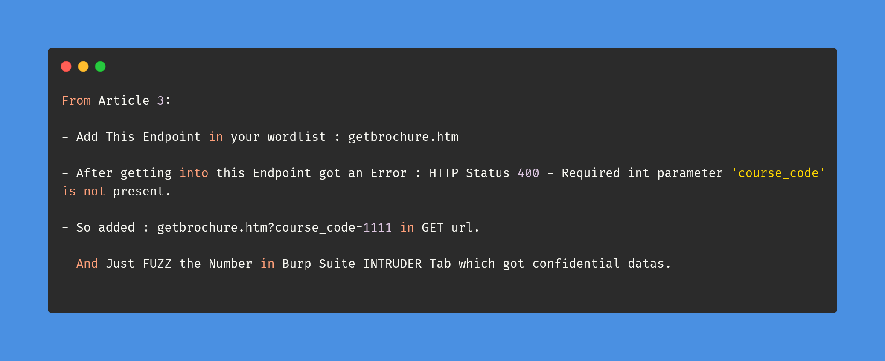

# Day-6 (30-Days-Of-Hacking)

### 1. Read 3 Article: [DONE]

- https://debprasadbanerjee502.medium.com/adobe-bug-bounty-using-idor-confidential-data-leaks-f6c55e5143d0
- https://debprasadbanerjee502.medium.com/what-ive-learned-from-hunting-bugs-for-2-months-dd982010347e
- https://debprasadbanerjee502.medium.com/how-i-hacked-iit-k-41653cc2fec4

#### Learned:

 

### 2. TryHackMe Labs: [DONE]

 - [X] Solved Complete Room Of **Toolbox: Vim && Phishing | Hidden Eye** : https://tryhackme.com/room/toolboxvim , https://tryhackme.com/room/phishinghiddeneye

### 3. PortSwigger Labs: [DONE]

 - [X] **Access control vulnerabilities (9/13)**
 -  Lab: User role can be modified in user profile  (https://portswigger.net/web-security/access-control/lab-user-role-can-be-modified-in-user-profile)
 -  Lab: User ID controlled by request parameter, with unpredictable user IDs  (https://portswigger.net/web-security/access-control/lab-user-id-controlled-by-request-parameter-with-unpredictable-user-ids)

### 4. Youtube Video: [FULL DONE]

 - Watched : BittenTech HTTP Security Headers | Content Security Policy (CSP) | Strict Transport Security (HSTS) : (https://www.youtube.com/watch?v=8_nfQAdWELU&t=1148s)
