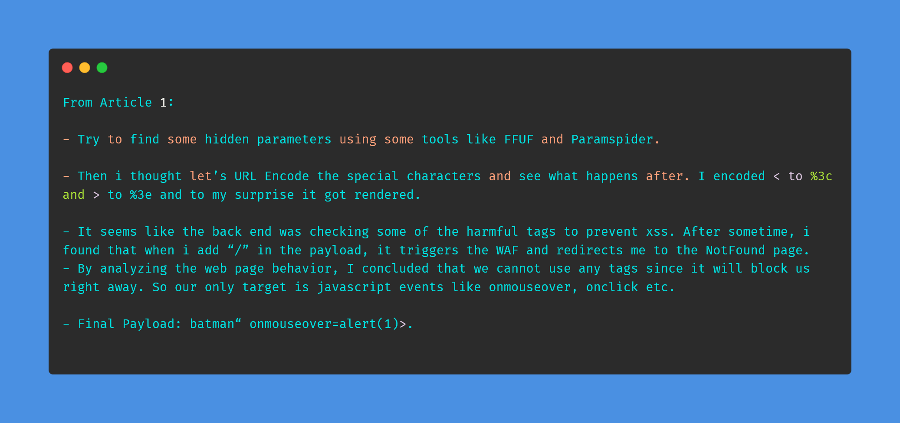
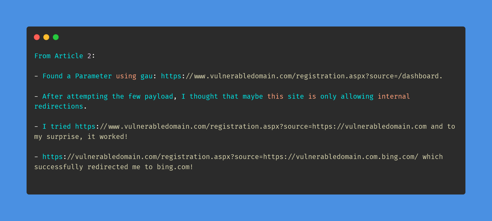
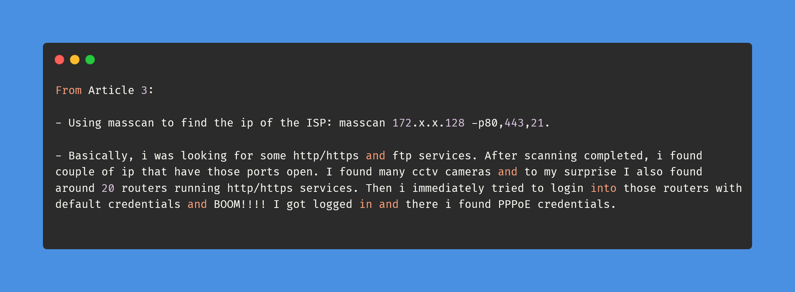

# Day-7 (30-Days-Of-Hacking)

### 1. Read 3 Article: [DONE]

- https://faiyazhacks.medium.com/story-of-an-encoded-xss-e83c7ea9e02
- https://faiyazhacks.medium.com/how-i-got-my-second-swag-2fa08a1dfd39
- https://faiyazhacks.medium.com/hacking-my-isp-for-free-internet-12d8ddad492

#### Learned:

### 2. TryHackMe Labs: [DONE]

 - [X] Solved Complete Room Of **RustScan && Nessus** : https://tryhackme.com/room/rustscan , https://tryhackme.com/room/rpnessusredux

### 3. PortSwigger Labs: [DONE]

 - [X] **Access control vulnerabilities (11/13)**
 -  Lab: URL-based access control can be circumvented  (https://portswigger.net/web-security/access-control/lab-url-based-access-control-can-be-circumvented)
 -  Lab: Method-based access control can be circumvented  (https://portswigger.net/web-security/access-control/lab-method-based-access-control-can-be-circumvented)

### 4. Youtube Video: [TODAY TIRED AF HAVEN'T WATCHED ANYTHING]
