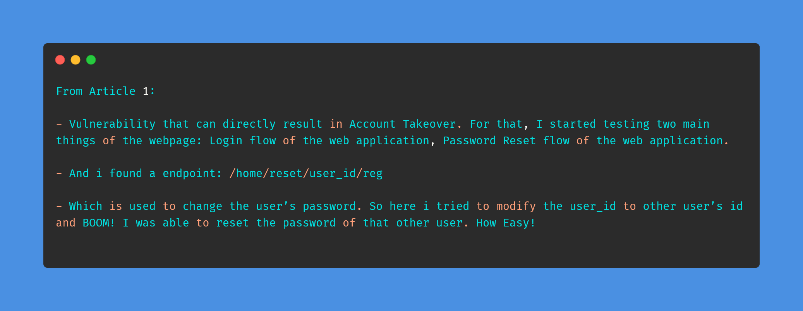
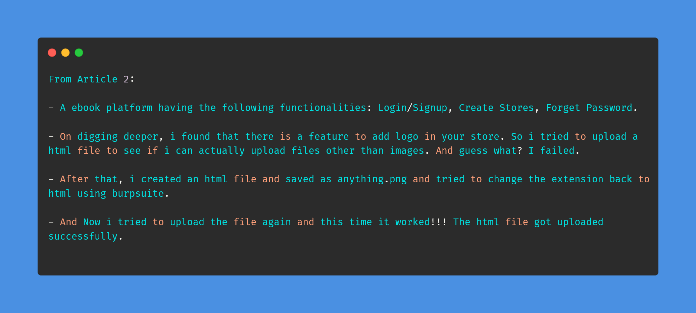
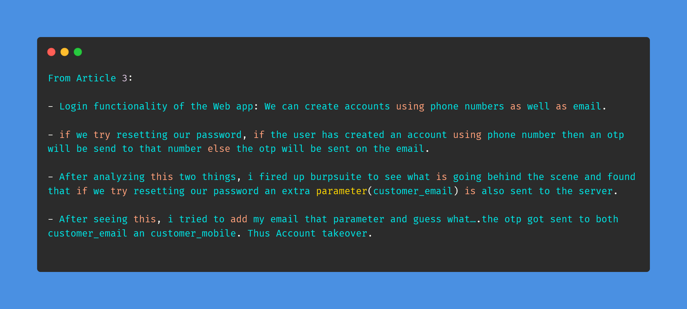

# Day-8 (30-Days-Of-Hacking)

### 1. Read 3 Article: [DONE]

- https://faiyazhacks.medium.com/i-d-o-r-to-account-takeover-834371d2365a
- https://faiyazhacks.medium.com/unrestricted-file-uploads-e361639913b1
- https://faiyazhacks.medium.com/first-bug-bounty-account-takeover-3b2c4ba9e091

#### Learned:

### 2. TryHackMe Labs: [DONE]

 - [X] Solved Complete Room Of **Tshark** : https://tryhackme.com/room/tshark

### 3. PortSwigger Labs: [DONE]

 - [X] **Access control vulnerabilities (12/13)**
 -  Lab: Multi-step process with no access control on one step   (https://portswigger.net/web-security/access-control/lab-multi-step-process-with-no-access-control-on-one-step)

### 4. Youtube Video: [DONE]

- Watched Arjun Tool by Intigriti: (https://www.youtube.com/watch?v=wRPxbz_Ht3k)
