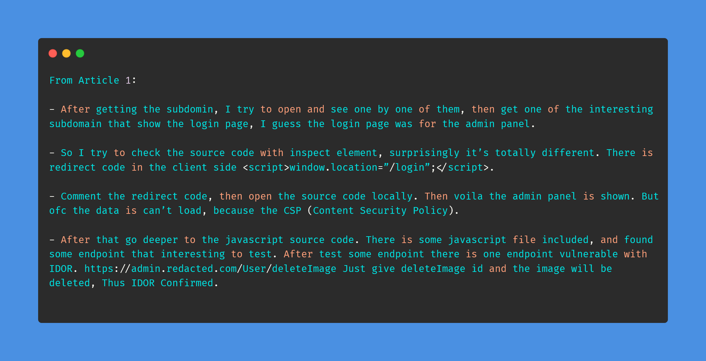
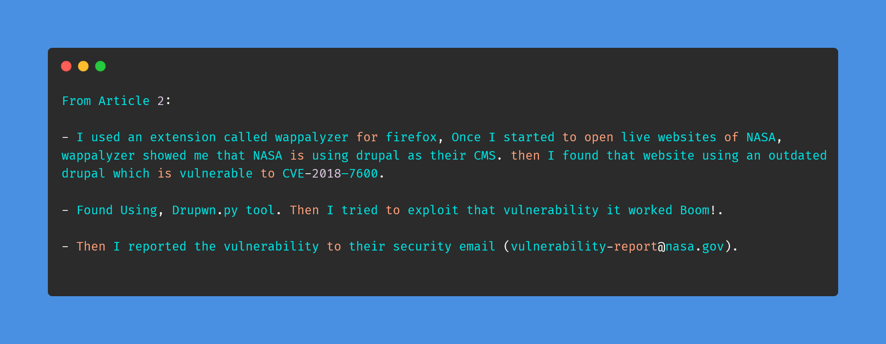
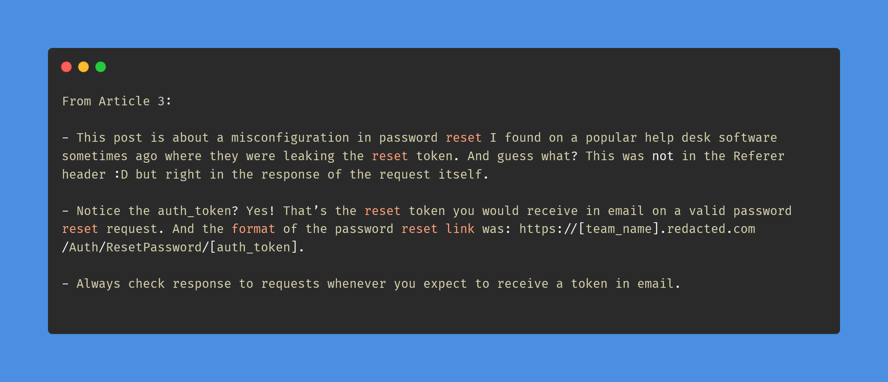

# Day-9 (30-Days-Of-Hacking)

### 1. Read 3 Article: [DONE]

- https://wahaz.medium.com/broken-authentication-and-idor-at-redacted-646de8d508e6
- https://medium.com/@harishhacker3010/how-i-hacked-nasa-to-execute-arbitrary-commands-in-their-server-29d44292a60a
- https://naveenroy008.medium.com/tale-of-a-misconfiguration-in-password-reset-e8fb484a4661

#### Learned:

### 2. TryHackMe Labs: [DONE]

 - [X] Solved Complete Room Of **FFUF** : https://tryhackme.com/room/ffuf

### 3. PortSwigger Labs: [DONE]

 - [X] **Access control vulnerabilities (13/13)**
 -  Lab: Referer-based access control    (https://portswigger.net/web-security/access-control/lab-referer-based-access-control)

### 4. Youtube Video: [DONE]

- Watched JWT_Tool.py by Intigriti (https://www.youtube.com/watch?v=ZGarKE9KTAY)
